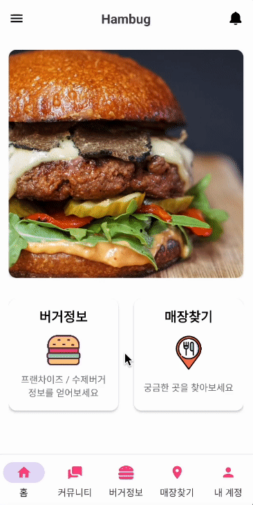

# 🍔 햄버그 (Hambug)

Android 개인 프로젝트

## 프로젝트 소개

프랜차이즈 / 수제버거 매장 정보를 얻을 수 있고, 햄버거와 관련된 게시글을 공유할 수 있는 앱

### 🛠️ 사용 기술

- XML

- Firebase
- Navigation
- Glide
- Retrofit
- Moshi
- Gson

### 🖥️ 개발 환경

- Programming Language : `Kotlin`
- IDE : `Android Studio`
- Minimum SDK Version : `28`
- Compile SDK Version : `33`
- Target SDK Version : `33`

 

## 페이지 기능

### 1) 홈

|                            splash                            |                       이미지 슬라이드                        |                       다른 페이지 이동                       |
| :----------------------------------------------------------: | :----------------------------------------------------------: | :----------------------------------------------------------: |
|  |  |  |

## 2) 커뮤니티

|                       커뮤니티 페이지                        |                      게시글 작성 페이지                      |                      게시글 상세 페이지                      |
| :----------------------------------------------------------: | :----------------------------------------------------------: | :----------------------------------------------------------: |
|  |  |  |

## 3) 버거정보

|                      프랜차이즈 페이지                       |                       수제버거 페이지                        |
| :----------------------------------------------------------: | :----------------------------------------------------------: |
|  |  |

## 4) 매장찾기

|                          매장 검색                           |                       햄버거 매장 확인                       |                          지도 확인                           |
| :----------------------------------------------------------: | :----------------------------------------------------------: | :----------------------------------------------------------: |
|  |  |  |
